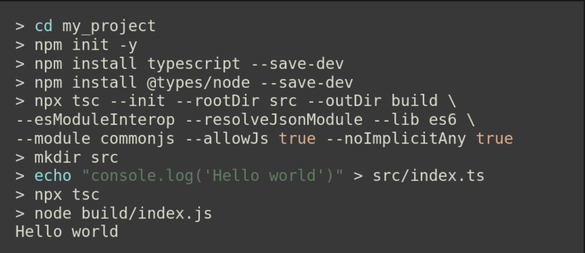

# DOCUMENTATION TP01 DEVOPS

**INITIALISATION DU PROJET**

**FAIRE LES COMMANDES SUIVANTES**
-  npm install express
-  npm install typescript ts-node @types/express --save-dev

**UTILISATION**
- Pour lancer le projet faire "npx ts-node index.ts"
- A l'aide de votre navigateur ou de curl, faire une requête get sur une des interfaces de votre pc sur le port affiché en console pour la route "/ping"
- Si ces trois conditions ne sont pas respectés, vous aurez une erreur 404
